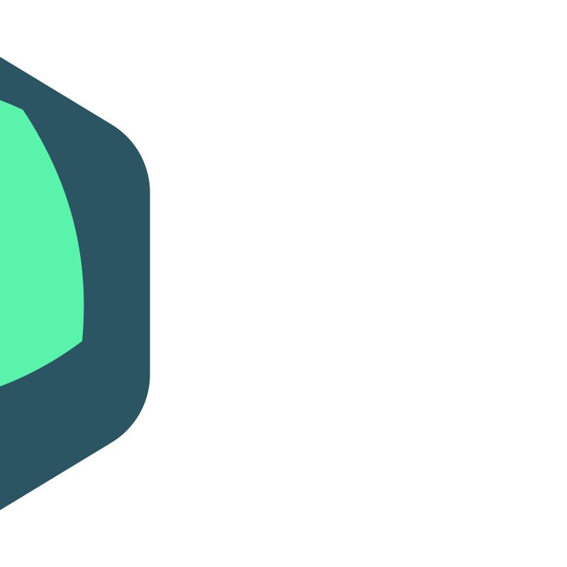
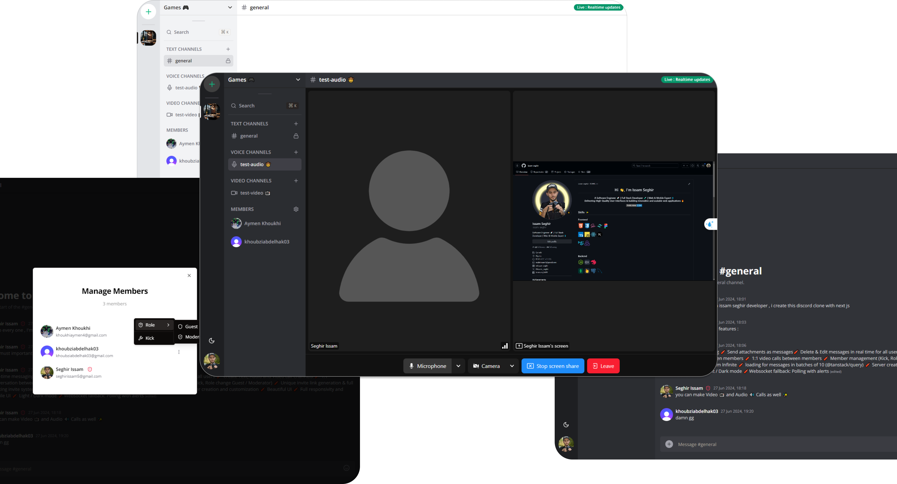
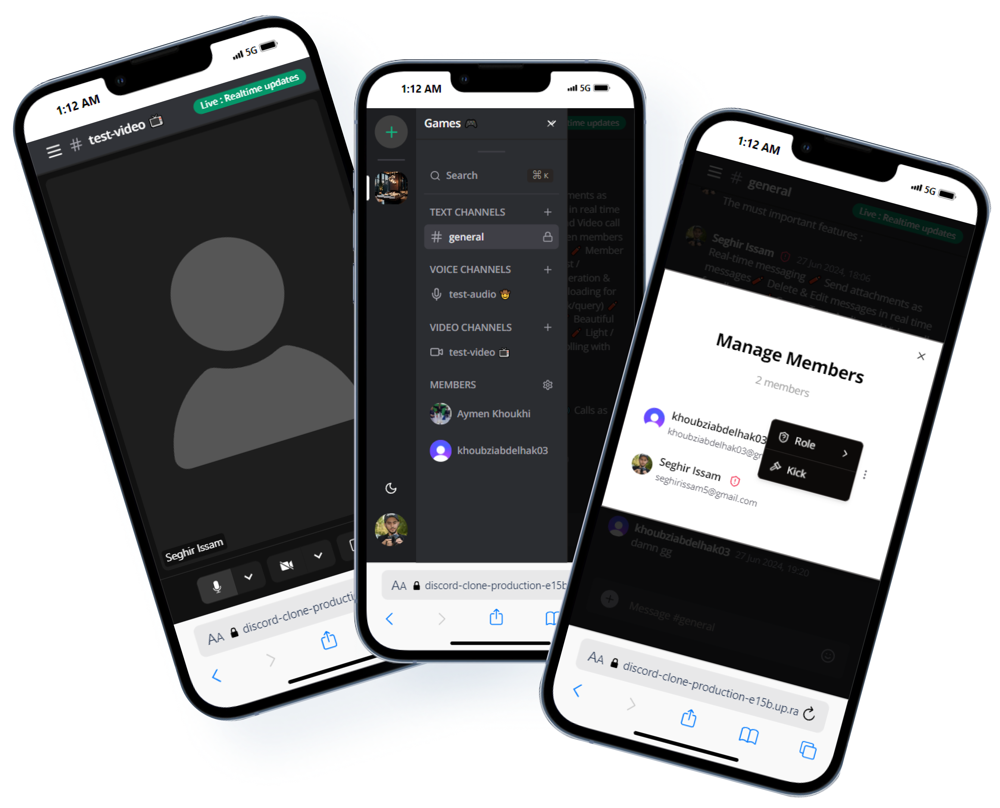

<div align="center">



<h1 align="center">Cycy</h1>

[](https://choosealicense.com/licenses/mit/)
[](https://cy-cy.vercel.app)

**Study like you know what you're bad at.**

AI course agents inside a real-time learning space — study, practice, and review in one continuous loop, with chat, DMs, and live audio/video.

<br />

**Live app:** [https://cy-cy.vercel.app](https://cy-cy.vercel.app)

<br />
<hr />

</div>

## Problem Statement

Students who study alone often can't tell if they actually understand something until it's too late — the exam. Existing tools each solve one slice and leave the rest to the student to stitch together:

| Tool category | Gap |
|---------------|-----|
| **Quizlet / flashcard apps** | Drill without diagnosis. Wrong is wrong; no insight into *why*. |
| **ChatGPT / generic AI tutors** | Answer questions but have no persistent model of what a specific learner does and doesn't understand. |
| **Duolingo** | Excellent gamification and retention, but content is broad/hobbyist — not mapped to real coursework. |
| **Study groups / Discord servers** | Social accountability exists, but no structured curriculum or diagnostic layer underneath the chat. |

**Nobody combines** real subject teaching + targeted, diagnostic practice + optional social accountability in a single loop.

## Solution

Cycy turns every course into an **AI agent** living inside its own server. Studying, practicing, and reviewing happen in one guided loop — not across five disconnected apps — and the platform names the specific misconception, not just "wrong."

### How it works

1. **Join a course** — Onboarding lands you in a course server with a dedicated AI agent.
2. **Learn concept by concept** — The agent runs a focused loop: study → quick check → practice → explain-back → spaced review.
3. **Get diagnosed, not just graded** — Misses surface typed misconceptions and micro-drills instead of a vague "incorrect."
4. **Stay in one place** — Mention the agent (`@Agent`) in a DM or channel; the same tutor meets you where you already chat.
5. **Optional social layer** — Peer DMs, invites, and real-time voice/video when you want accountability without leaving the platform.

### What this gives learners

- **"I know exactly what I'm bad at"** — Misconceptions are typed and diagnosed, not just marked wrong.
- **"I won't forget it in three weeks"** — Spaced repetition tuned to individual gaps.
- **"I'm not doing this alone — unless I want to be"** — Solo practice by default; social features optional.
- **"It's built for my actual course"** — Curriculum-mapped content, not generic trivia.

### Platform capabilities

Built on a full real-time communication stack so learning and community share the same space:

- Servers, text / audio / video channels, and member roles
- Real-time chat (Socket.io) with edit/delete sync
- Direct messages and invite links
- LiveKit audio & video calls
- File attachments (UploadThing)
- Auth via Clerk

## Screenshots

<p align="center">
  
</p>

<p align="center">
  
</p>

## Live Demo

Try Cycy here: **[https://cy-cy.vercel.app](https://cy-cy.vercel.app)**

## Built With

- 
- 
- 
- 
- 
- 
- 
- 
- 
- 
- 
- 
- 

## Features

- 🔒 **Authentication + Google Auth** with **Clerk**
- 🧠 **AI course agents** with a concept-by-concept learning loop
- 🎉 **Server** creation and customization (each course = a server)
- 📱 **Real-time** messaging using **Socket.io**
- 📳 **Websocket fallback**: polling with alerts
- 🚀 **Text**, **Audio**, and **Video** channels
- 📨 **Conversations** between members and with the agent
- 🎬 **Video** and 🔊 **Audio** calls (LiveKit)
- 🎁 **Attachments** via **UploadThing**
- 🧨 **Delete & edit** messages in real time
- 🔰 **Member management** (kick, Guest / Moderator roles)
- 🔗 **Invite links** with a full invite flow
- ⛓ **Infinite loading** for messages (**@tanstack/query**)
- 🔍 **Search** command palette
- 🎨 **Light / dark** theme
- 🎊 **Responsive** design

## Getting Started

1. Clone the repo

   ```sh
   git clone https://github.com/Peliah/cycy.git
   cd cycy
   ```

2. Install dependencies

   ```sh
   npm install
   ```

3. Copy `.env.example` to `.env` and fill in the required keys

4. Start the dev server

   ```sh
   npm run dev
   ```

Open [http://localhost:3000](http://localhost:3000) to view the app locally.

## Deploy on Vercel

The easiest way to deploy is the [Vercel Platform](https://vercel.com/new?utm_medium=default-template&filter=next.js&utm_source=create-next-app&utm_campaign=create-next-app-readme).

Production demo: [https://cy-cy.vercel.app](https://cy-cy.vercel.app)

## Contributing

Contributions are welcome. Fork the repo, open a feature branch, and submit a pull request. You can also open an issue with the tag `enhancement`.

1. Fork the Project
2. Create your Feature Branch (`git checkout -b feature/AmazingFeature`)
3. Commit your Changes (`git commit -m 'Add some AmazingFeature'`)
4. Push to the Branch (`git push origin feature/AmazingFeature`)
5. Open a Pull Request

## License

Distributed under the MIT License. See `LICENSE` for more information.
