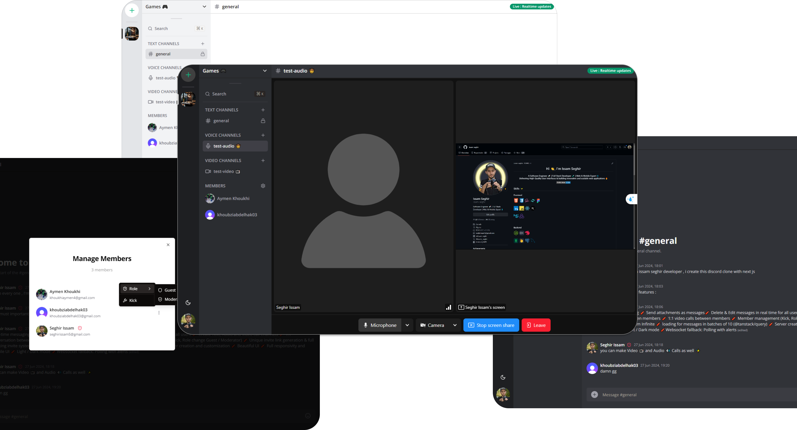
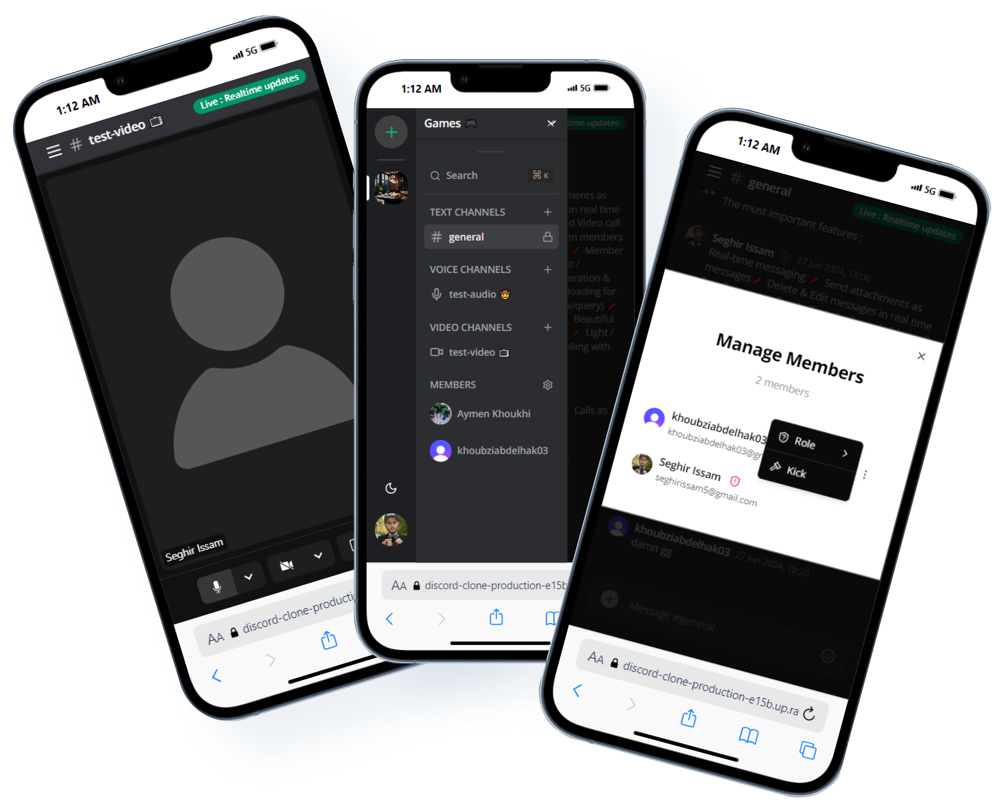
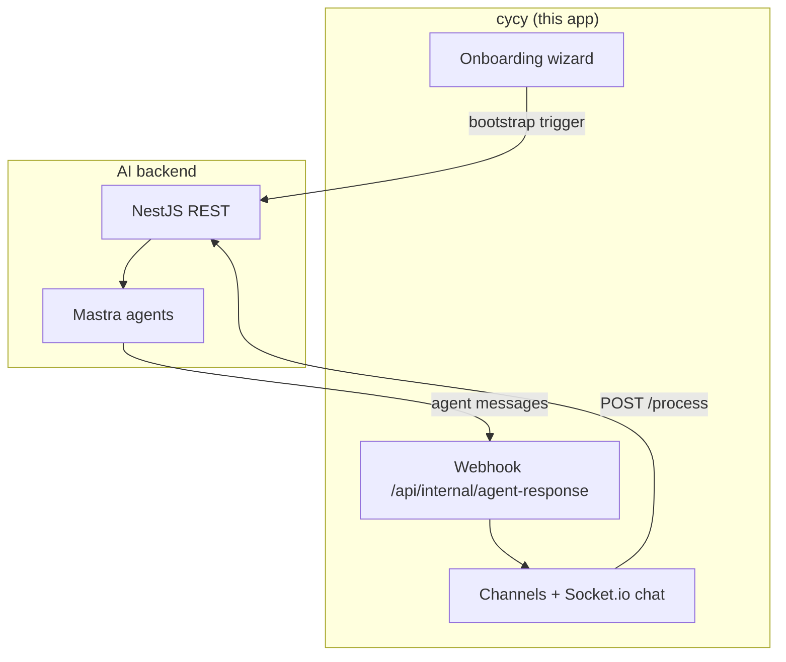

<div align="center">


<h1 align="center">Cycy</h1>

**Real-time learning communities with an AI tutor — Discord-style servers meet personalized curriculum.**

[](./LICENSE)

[Hackathon overview](../README.md) · [AI backend docs](../backend/README.md) · [Live demo](#getting-started)

</div>

<br>




---

## AI learning (hackathon feature)

Cycy is not just chat — each study circle gets a **generated course** and a **personal agent tutor**:

| Step | User experience | Backend |
|------|-----------------|---------|
| Onboarding | Name circle, set goal, upload PDFs/DOCX | — |
| Bootstrap | “Generating curriculum…” on roadmap | `POST /api/v1/servers/:id/bootstrap` |
| Learn | Agent DM: study → MCQ → practice → gates | Mastra 8-agent workflow |
| Complete | Mock interview + certificate | Goal verification agents |


```mermaid
flowchart TB
  subgraph Cycy["cycy (this app)"]
    ON[Onboarding wizard]
    CH[Channels + Socket.io chat]
    WH["Webhook /api/internal/agent-response"]
  end

  subgraph Nest["AI backend"]
    API[NestJS REST]
    MA[Mastra agents]
  end

  ON -->|bootstrap trigger| API
  CH -->|POST /process| API
  API --> MA
  MA -->|agent messages| WH
  WH --> CH
```

**Integration files**

| Path | Role |
|------|------|
| `src/lib/learning/trigger-agent-process.ts` | Fire backend `/process` after user message |
| `src/pages/api/internal/agent-response.ts` | Receive AI replies, persist + socket emit |
| `src/lib/learning/load-curriculum-content.ts` | Pull full curriculum from Nest after `READY` |
| `src/lib/prismadb.ts` | Shared Neon DB with pooler params |

Full wiring guide: [backend/docs/FRONTEND_INTEGRATION.md](../backend/docs/FRONTEND_INTEGRATION.md)

---

## Community features

- 🔒 **Authentication** with Clerk (+ Google)
- 🎉 **Server** creation, invites, roles (Guest / Moderator / Admin)
- 📱 **Real-time messaging** via Socket.io (polling fallback)
- 🚀 **Text, audio, and video channels** (LiveKit)
- 📨 **Direct messages** between members
- 🎁 **Attachments** via UploadThing
- 🧨 **Edit / delete** messages in real time
- 🔍 **Search** command palette
- 🎨 **Light / dark** theme
- 📱 **Responsive** layout

---

### Built with

- 
- 
- 
- 
- 
- 
- 

Plus **NestJS + Mastra** in [`../backend`](../backend) for AI orchestration.

---

## Getting started

### Prerequisites

- Node.js 22+, pnpm (or npm)
- Neon PostgreSQL (shared with backend)
- Clerk app
- Running [AI backend](../backend) on port 4000 for full learning flow

### 1. Install & configure

```bash
git clone <repo-url>
cd reeps-hack/cycy
pnpm install
cp .env.example .env
```

Required in `.env`:

```env
DATABASE_URL=postgresql://...@ep-xxx-pooler....neon.tech/...
CLERK_SECRET_KEY=...
NEXT_PUBLIC_CLERK_PUBLISHABLE_KEY=...
AI_BACKEND_URL=http://localhost:4000
CYCY_INTERNAL_SECRET=...          # must match backend
```

### 2. Database

```bash
pnpm prisma migrate deploy
# optional: pnpm prisma db seed
```

Then apply [backend migrations](../backend) on the same database.

### 3. Run

```bash
# Terminal 1 — backend (from repo root)
cd ../backend && pnpm dev

# Terminal 2 — frontend
pnpm dev
```

Open [http://localhost:3000](http://localhost:3000).

### Demo path

1. Sign in → **Create a group** → set learning goal → upload a PDF  
2. Wait for curriculum generation (roadmap shows progress)  
3. Open the **agent DM** channel → send “Let’s start”  
4. Follow study → MCQ → practice → module quiz → mock interview  

See the [root demo script](../README.md#demo-flow-for-judges).

---

## Deploy on Vercel

1. Set **root directory** to `cycy`
2. Add all env vars from `.env.example`
3. Run `prisma migrate deploy` (build step or manual against Neon)
4. Point `AI_BACKEND_URL` at your Render backend URL
5. Set backend `CYCY_URL` to your Vercel URL

[Next.js deployment docs](https://nextjs.org/docs/deployment)

---

## Project structure (learning-related)

```text
src/
├── components/onboarding/     Wizard — goal, materials, bootstrap
├── lib/learning/              Bootstrap trigger, curriculum sync, agent DM
├── pages/api/internal/        agent-response webhook
├── pages/api/socket/          Real-time messages + agent trigger
└── hooks/                     Onboarding, uploads, roadmap
```

---

## Contributing

Contributions welcome — fork, branch, PR. See [LICENSE](./LICENSE).

## License

MIT — see [LICENSE](./LICENSE).
